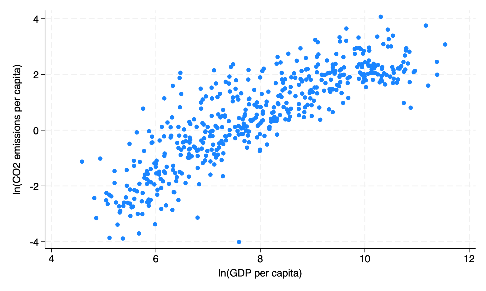
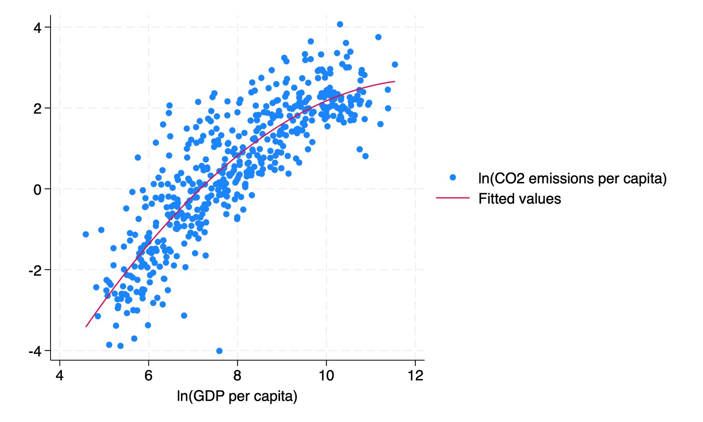

# Economic Growth, Trade, and FDI as Determinants of CO2 Emissions

*Stata · Panel data, 173 countries, 1990–2010 · Final project for Multiple Regression
and Introduction to Econometrics, NYU Wagner (May 2026)*

## What I wanted to find out

Countries are trying to grow through trade and foreign investment while also cutting
emissions. I wanted to understand what actually drives CO2 emissions: whether emissions
eventually fall as countries get richer (the Environmental Kuznets Curve), and whether
foreign investment moves dirty industries to developing countries (the "pollution haven"
effect) or brings cleaner technology (the "halo" effect).

## Data and method

I used World Bank World Development Indicators for 173 countries in 1990, 2000, and
2010. After dropping missing values, I had 460 country-year observations. All variables
are in logs, so the coefficients can be read as elasticities.

I regressed CO2 emissions per capita on GDP per capita and its square, FDI net inflows,
exports and imports as a share of GDP, and population. I estimated three models: pooled
OLS, country fixed effects, and country plus year fixed effects (my preferred model).
A Hausman test (χ² = 139.10, p < 0.001) rejected random effects in favor of fixed
effects, and a Breusch-Pagan test showed heteroskedasticity, so I used robust and
country-clustered standard errors.

## What I found

- **Income is the only robust driver of emissions.** In my preferred model, a 1%
  increase in GDP per capita is associated with about a 0.37% increase in CO2 emissions
  per capita at the average income level.
- **The EKC shape shows up, but most countries are nowhere near the turning point.**
  The squared income term is negative in every model, but the implied turning points
  (roughly $156,000 to $513,000 per person) are far above the highest income in the
  data ($103,000 in Qatar).
- **FDI and trade stop mattering once I compare countries to themselves over time.**
  They were significant in pooled OLS but lost significance with fixed effects. The
  pooled results mostly reflected differences between countries, not a within-country
  effect, so I found no strong evidence for either the pollution haven or halo effect.

## Limitations and next steps

The panel only has three time points, and income and emissions may affect each other
(reverse causality). Next, I'd extend the data past 2010 and break FDI down by sector
to test whether the type of foreign investment matters more than the amount.

## Files

- `co2_analysis.do`: Stata code (set your own data paths at the top)
- `fig1.png`, `fig2.png`: figures

Data: [World Bank World Development Indicators](https://databank.worldbank.org/source/world-development-indicators)
